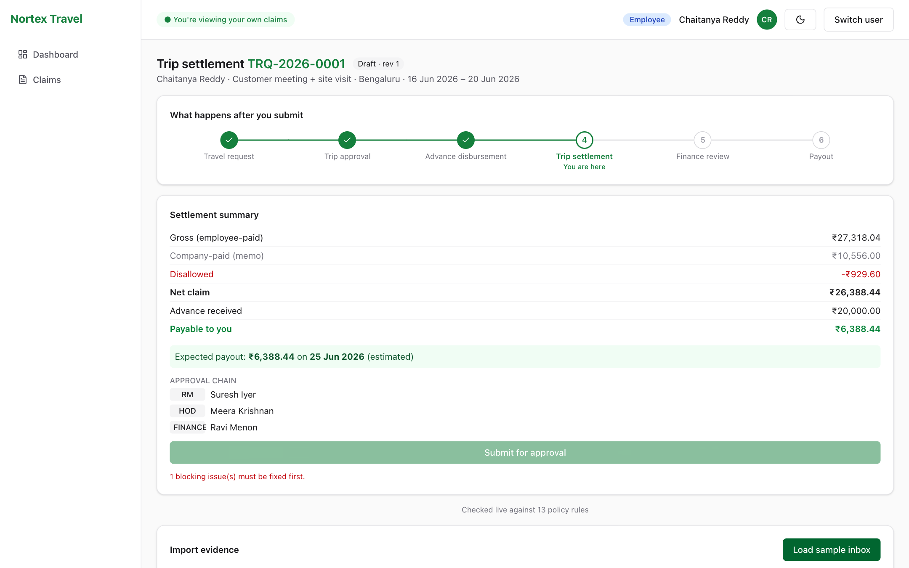
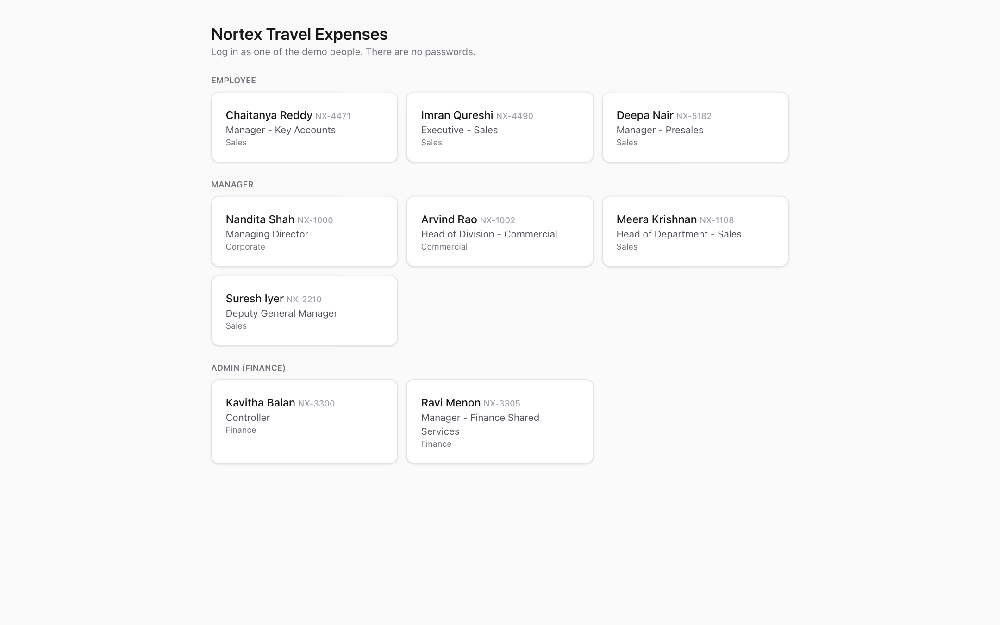
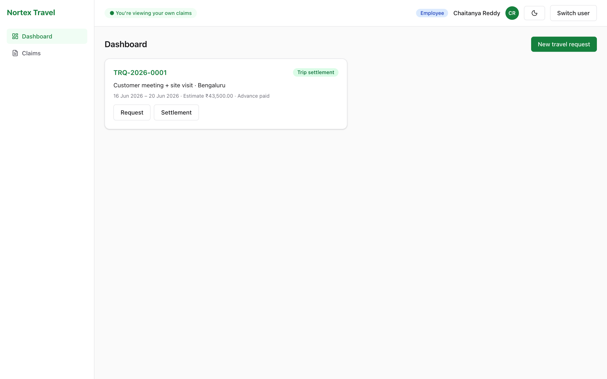
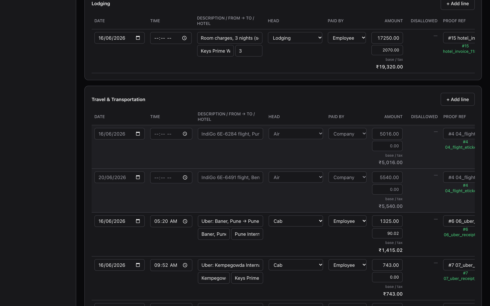

# Nortex Travel Expense Reimbursement

A working full-stack prototype that turns a traveller's inbox into a policy-checked expense claim, routes it through the
right approvers to Finance, and shows every claim's stage, who it is waiting on, and the expected payout.

> **The LLM proposes, deterministic Python decides, the human confirms.**
> A model only *extracts fields* from an email or a photo of a bill. Every policy decision (what counts, what is
> disallowed and why, duplicates, the approval chain, the payout date) is plain, unit-tested Python. The employee reviews
> and edits every proposed line before submitting.



<details>
<summary>More screenshots</summary>

| Login ("log in as" picker) | Dashboard ("where's my money") |
|---|---|
|  |  |

Dark mode (toggle in the top bar):


</details>

## Why it exists

Travellers hand-copy bookings, receipts and approvals from email into an Excel form (25–30 minutes), which is where the
errors come from (duplicates, personal items, other people's bills, wrong category). The form then crawls up an approval
chain and the employee chases Finance for two weeks. This app removes all three:

| Problem | What the app does |
|---|---|
| 25 minutes of copying | **Import** `.eml` files and receipt images; every document is triaged and a filled-in claim is proposed |
| Errors | **Validate** every line against the policy on the server; show exactly what was disallowed and why; block submission while a blocking error exists |
| Chasing Finance | **Track** every item: current stage, who it waits on, and "Expected payout: ₹X on <date>" |

## Quick start

**One command (Docker):**

```bash
cp .env.example .env          # API keys are optional, see "Environment"
docker compose up --build     # then open http://localhost:8001
```

The container listens on 8000; compose publishes it on host port **8001** (change the left side of the port mapping in
`docker-compose.yml` if you prefer another).

**Without Docker** (Python 3.12, Node 20):

```bash
cd backend && python3.12 -m venv .venv && .venv/bin/pip install -r requirements.txt
.venv/bin/uvicorn app.main:app --reload --port 8000

cd frontend && npm install && npm run dev      # http://localhost:5173, /api proxied to :8000
```

The app runs fully offline: extractions for the sample pack are committed, so no API key is needed. The database is
SQLite and is seeded on first start.

## Try it: the demo path (≈4 minutes)

There are no passwords. Pick a person on the login screen (all authorization is enforced on the server).

| App role | People |
|---|---|
| Employee | Chaitanya Reddy `NX-4471`, Deepa Nair `NX-5182`, Imran Qureshi `NX-4490` |
| Manager | Suresh Iyer `NX-2210` (RM), Meera Krishnan `NX-1108` (HoD), Arvind Rao `NX-1002` (HoDiv), Nandita Shah `NX-1000` (MD) |
| Admin (Finance) | Ravi Menon `NX-3305`, Kavitha Balan `NX-3300` |

1. **Chaitanya** → open the settlement for `TRQ-2026-0001` → **Load sample inbox**. 15 emails and 2 receipts are
   triaged: the duplicate Uber resend, the failed payment, the hotel voucher (not a bill), a colleague's ride and the promo
   are excluded or ignored; company-paid flights become memo lines; the hotel folio is split with laundry and minibar
   *disallowed, not dropped*.
2. The summary shows **net ₹26,388.44, payable ₹6,388.44** and the chain **Suresh → Meera → Ravi**. Submit is blocked: the
   client dinner needs attendees. Add four from Vertex Technologies, then submit.
3. **Suresh** returns the claim with a remark; **Chaitanya** resubmits (same TRQ id, revision 2); Suresh then **Meera**
   approve (Meera is required because the claim is over ₹25,000 and the entertainment line is over ₹2,000).
4. **Ravi** verifies. A payout of ₹6,388.44 is scheduled for **25 Jun 2026**; mark it paid. The stepper and timeline
   show every step.

The full script with talking points is in [`DEMO.md`](DEMO.md).

## How it works

```
 .eml / images ─▶ ingest ─▶ extract (LLM, cached by sha256) ─▶ triage (deterministic) ─▶ proposed claim lines
                                                                                                │
 employee edits ◀──────────────────────────  policy engine: rules → findings, summary, chain ◀──┘
        │
        └─▶ workflow state machine (the only place statuses change) ─▶ approvals ─▶ Finance ─▶ payment run
                                       every transition writes an append-only audit event
```

- **Money is integer paise** end to end; the UI formats it as `₹26,388.44` with Indian digit grouping.
- **Validation lives only on the server.** The UI calls `/validate` after every edit and renders the findings; no
  rule is re-implemented in TypeScript.
- **Policy constants** (tier caps, thresholds, keywords, payment-run days) all live in `backend/app/policy/config.py`,
  and each rule in `rules.py` carries a comment with its policy clause (e.g. `# policy §3.1`).

### Ingestion triage (first match wins)

Promotional/other → *ignored* · travel approval / advance notice → *ignored (reference)* · booking voucher →
*excluded (not a bill)* · payment failed → *excluded* · another person's expense → *excluded* · duplicate →
*excluded* · corporate-card spend → *used as company memo* · hotel tax invoice → *used, split by item* ·
client dinner → *used as business entertainment* · cab receipt → *used* · anything else → *used with a "review
category" warning*. Every outcome records a human-readable reason and the policy clause.

### Policy rules enforced

| Rule | Severity | Policy |
|---|---|---|
| Every line needs proof; the settlement must have lines | BLOCK | §5.2 |
| Duplicate bill (across all employees) | BLOCK | §5.3 |
| Business entertainment needs ≥1 attendee with name and organisation | BLOCK | §3.5 |
| Advance ≤ 60% of employee-borne estimate; valid dates; city tier chosen; at least one cost head | BLOCK | §1.2, §3.1 |
| Lodging over the tier cap (₹6,000 / ₹4,000 / ₹2,800 per night) | DISALLOW the excess | §3.1 |
| Laundry, minibar, spa, fines, … ; alcohol outside entertainment; employee-paid air | DISALLOW 100% | §4, §3.2 |
| Meals over the daily cap (₹1,500 Tier 1, else ₹1,000) | DISALLOW the excess | §3.3 |
| Entertainment over ₹2,000 forces HoD into the chain; missing prior approval | WARN | §3.5 |
| Line outside the trip window; submitted more than 7 days after return | WARN | §5.1 |
| Company-paid lines | INFO (memo, never reimbursed) | template |

### Approval chain

Levels depend on value: Reporting Manager always; HoD above ₹25,000; Head of Division above ₹75,000; MD above
₹2,00,000 or for international trips. Finance always comes last and only on settlements. A missing role escalates to the
next higher role in the reporting line, with a recorded note; nobody ever approves their own request, and only the current
pending approver can act. Payouts go out on the first 10th or 25th on or after verification.

## Repository layout

```
backend/app/
  main.py  config.py  db.py  models.py  schemas.py (the API contract)  auth.py  clock.py  money.py  seed.py
  policy/    config.py  rules.py  chain.py  payments.py
  workflow.py                 # the only place statuses change; writes the audit trail
  ingest/    eml.py  extract.py  triage.py  folio.py  importer.py  build_cache.py
  routers/   auth  requests  settlements  approvals  finance  evidence
backend/fixtures/extractions/ # cached model output for the sample pack (committed)
backend/tests/                # chain, rules, payments, workflow, sample pack, API smoke test
frontend/src/                 # React + Vite + Tailwind; api/types.ts mirrors schemas.py
pack/                         # the original assignment files, untouched
```

## Tests

```bash
cd backend && .venv/bin/python -m pytest -q
```

71 tests, all offline. They cover every row of the approval-chain table, every policy rule, payment-run dates, the
state machine and its invariants (illegal transition → 409, out-of-turn approver → 403, no self-approval, reject →
full-advance recovery), the **golden sample-pack import** (each of the 17 documents triaged, summary of gross
₹27,318.04 / disallowed ₹929.60 / net ₹26,388.44), and the full HTTP happy path.

## Environment (`.env.example`)

| Variable | Purpose |
|---|---|
| `OPENAI_API_KEY`, `OPENAI_MODEL` | Extraction for documents *not* in the cache. Leave empty to run fully offline: cached extractions are used and anything uncached falls back to manual entry |
| `APP_TODAY` | Freezes "today" (`2026-06-22`) so the June 2026 demo trip isn't late |
| `SESSION_SECRET` | Signs the session cookie. Set your own |
| `COOKIE_SECURE` | `true` on HTTPS hosts |
| `DATABASE_URL` | SQLite by default (`sqlite:///./data/app.db`) |
| `PACK_DIR` | Assignment pack folder (`../pack`; `/app/pack` in Docker) |

To rebuild the extraction cache with a real key: `cd backend && python -m app.ingest.build_cache`.

## Deploy (Render)

Create a **Docker** web service from this repo. The Dockerfile builds the React app, serves it from FastAPI, binds to
`$PORT` and runs uvicorn with `--proxy-headers --forwarded-allow-ips='*'` so it sees Render's HTTPS. Set
`SESSION_SECRET`, `APP_TODAY=2026-06-22`, `COOKIE_SECURE=true` and `PACK_DIR=/app/pack`. An OpenAI key is not needed.
On the free plan the SQLite file resets on every redeploy and the app re-seeds on boot.

## Known limitations

- **Extraction quality.** A model can misread a damaged photo (the pack's hotel folio has a fold). Reconciling the
  folio against its totals and the booking voucher catches that case, not every case; the employee is the final check.
- **Name matching** for "someone else's expense" uses first and full name, so a colleague with the same first name
  would slip through.
- **No Tier 2 city list** in the policy, so non-Tier-1 cities need the user to pick Tier 2 or 3.
- **Prior HoD approval** for entertainment is a reference field and a warning, not a separate pre-trip workflow.
- **Top of the chain.** The MD's own claims have no business approver above them (only Finance verifies); Kavitha can
  appear twice in Ravi's chain. Separation of duties goes no further than "not yourself".
- **Storage.** SQLite and local files are fine for a prototype; production needs Postgres and object storage.
- One settlement per request, INR only, no real mailbox connection, no notifications.

See [`NOTE.md`](NOTE.md) for the assumptions behind these choices and what was deliberately left out.
